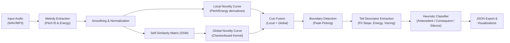

# MC-MSA

An experimental tool to segment and classify the melodic structure of an audio recording.
The workflow is inspired by MSAF but focuses on melody: it extracts the contour
(pitch and energy), detects structural changes, and labels each phrase with strict
academic roles: **Antecedent** (`A`), **Consequent** (`C`), or **Silence/Transition** (`X`).

The section detector combines two change cues in a hybrid approach: a derived novelty curve
(local transitions based on pitch and energy derivatives) and a global novelty curve calculated from a 
self-similarity matrix (SSM) using a checkerboard kernel.

## Installation

```bash
python -m venv .venv
source .venv/bin/activate
pip install -e .[dev]
```

## Usage

From the command line:

```bash
python -m melody_analysis path/to/audio.wav \
    --output result.json \
    --melody-plot contour.png \
    --sections-plot sections.png
```

The `--melody-plot` and `--sections-plot` parameters save two images:
one with the extracted melodic contour and another with the mel spectrogram where
the sections described in the JSON are highlighted.

If you want to experiment with an independent copy of the pipeline without modifying the
original implementation, a clone is available under the name
`melody_analysis_v2` with the same entry points:

```bash
python -m melody_analysis_v2 path/to/audio.wav \
    --output result.json \
    --melody-plot contour_v2.png \
    --sections-plot sections_v2.png
```

### Decoupled Segmenters & Classifiers (Thesis vs. Beta)

The `melody_analysis_v2` pipeline decouples structural segmentation from classification to support both historical thesis replication and experimental extensions:

* **Thesis (Default/Standard)**
  * **Segmenter (`MelodySegmenter`)**: Employs the hybrid novelty curve calculation (SSM global structure fused with local pitch/energy derivatives).
  * **Classifier (`MelodyClassifierThesis`)**: Implements the strict 3-class academic rules (`A` for Antecedent, `C` for Consequent, and `X` for Transition).
  * *Usage*: Run evaluations using `run_mc_msa.py` or the CLI `--segmenter thesis --classifier thesis`.

* **Beta (Experimental)**
  * **Segmenter (`MelodySegmenterBeta`)**: Uses **pure SSM-based novelty detection** (entirely removes local derivative boundary refinements to simplify model explanations).
  * **Classifier (`MelodyClassifierThesisBeta`)**: Implements a refined/corrected set of decision rules for the 3-class classification system.
  * *Usage*: Run evaluations using `run_mc_msa_beta.py` or the CLI `--segmenter beta --classifier beta`.

In code:

```python
from melody_analysis import (
    MelodyClassifier,
    MelodyAnalyzer,
    plot_f0_no_segments,
    plot_f0_only,
    plot_melody_only,
    plot_melody_contour,
    plot_spectrogram_with_segments,
)
import librosa

analyzer = MelodyAnalyzer()
result = analyzer.analyze_file("path/to/audio.wav")
for segment in result.segments:
    print(segment.label, segment.segment.start_time, segment.segment.end_time)

# Generate visualizations directly from Python
fig1 = plot_melody_contour(result)
audio, sample_rate = librosa.load("path/to/audio.wav", sr=22050)
fig2 = plot_spectrogram_with_segments(audio, sample_rate, result)
# If you only want the melodic contour without energy or f0:
fig_melody = plot_melody_only(result)
# If you only want the f0 curve in Hz:
fig_f0 = plot_f0_only(result)
# If you prefer f0 without any segment overlay:
fig_f0_flat = plot_f0_no_segments(result)
# Normalized signal + novelty curves (uses analyze_file/analyze_audio)
fig_novelty = plot_signal_and_novelty(result)
# Self-similarity matrix (pitch + energy)
fig_ssm = plot_self_similarity(result)
# Plots include the contour in MIDI and the f0 curve (Hz) overlaid when applicable.

# Do you want to rename the labels (e.g. "antecedent" -> "A" and "consequent" -> "C")?
# Just change the line where the analyzer is created and pass aliases to the classifier;
# no need to modify anything else, and colors/legends are preserved.
analyzer_custom = MelodyAnalyzer(
    classifier=MelodyClassifier(label_aliases={"antecedent": "A", "consequent": "C"})
)
result_custom = analyzer_custom.analyze_file("path/to/audio.wav")
```

If you want to directly use the clone with improved colors (`melody_analysis_v2`)
from a script like the one shown (`from src.melody_analysis_v2 import ...`),
make sure first to have installed the project in editable mode (`pip install -e .`)
or export `PYTHONPATH=src` before running the script. Then import without the
`src` prefix like this:

```python
from melody_analysis_v2 import (
    MelodyAnalyzer,
    MelodyClassifier,
    plot_f0_no_segments,
    plot_f0_only,
    plot_melody_only,
    plot_melody_contour,
    plot_spectrogram_with_segments,
)
import librosa

analyzer = MelodyAnalyzer()
result = analyzer.analyze_file("1.mp3")
for segment in result.segments:
    print(segment.label, segment.segment.start_time, segment.segment.end_time)

# To rename labels in this same example, change the line above to:
# analyzer = MelodyAnalyzer(
#     classifier=MelodyClassifier(label_aliases={"antecedent": "A", "consequent": "C"})
# )

fig1 = plot_melody_contour(result)
audio, sample_rate = librosa.load("1.mp3", sr=22050)
fig2 = plot_spectrogram_with_segments(audio, sample_rate, result)
# Minimalist visualization of pitch in MIDI only
fig_melody = plot_melody_only(result)
# Minimalist visualization of f0 in Hz only
fig_f0 = plot_f0_only(result)
# Visualization of f0 without segment overlays
fig_f0_flat = plot_f0_no_segments(result)
```

### Quick Guide to Rename Labels (e.g. to A/C or any alias)

1. **Via code (v1 or v2):** when creating the analyzer, pass `label_aliases` to the
   classifier. You only need to modify that line.

   ```python
   from melody_analysis import MelodyAnalyzer, MelodyClassifier  # or melody_analysis_v2

   analyzer = MelodyAnalyzer(
       classifier=MelodyClassifier(label_aliases={"antecedent": "A", "consequent": "C"})
   )
   result = analyzer.analyze_file("path/to/audio.wav")
   ```

2. **Using your custom script:** search for where the analyzer is created and replace `analyzer = MelodyAnalyzer()` with the aliased version:
   ```python
   analyzer = MelodyAnalyzer(
       classifier=MelodyClassifier(label_aliases={"antecedent": "A", "consequent": "C"})
   )
   ```

### Quick Checklist to Use the Visualizer in Your Own Script

If you already have a script similar to the previous example and it seems to "do
nothing", check these points:

1) Install the project in editable mode (`pip install -e .[dev]`) or export
   `PYTHONPATH=src` in the same session before running it. This ensures the
   imports `from melody_analysis_v2 import ...` work without the `src.` prefix.
2) Call the visualization functions (`plot_melody_contour` and
   `plot_spectrogram_with_segments`) just like in the snippet and save or
   show the figures:

```python
fig1 = plot_melody_contour(result)
fig1.savefig("contour.png", dpi=150)
audio, sample_rate = librosa.load("1.mp3", sr=22050)
fig2 = plot_spectrogram_with_segments(audio, sample_rate, result)
fig2.savefig("sections.png", dpi=150)
```

3) If you want to see interactive windows, export a backend with graphical support,
   for example `MPLBACKEND=TkAgg`, or run the script in an environment that
   already has an interactive backend. If Matplotlib remains in `Agg` mode, the
   figures will be saved to disk (as in the previous example) and no windows will open.

Following these steps, your snippet will use the visualizer just like in the clone
`melody_analysis_v2` with colors for each classification.

Analogously, you can import `MelodyAnalyzer` from `melody_analysis_v2` to
modify it freely without affecting the original module.

### Step-by-Step Example with the `melody_analysis_v2` Clone

If you are running the project locally, you can check the pre-configured script `examples/visualizar_melodia_v2.py` (which is kept locally but excluded from Git tracking to maintain a clean repository). It explains the entire flow line-by-line in Spanish, prints the detected segments to the console, and saves both the melodic contour and the two spectrograms (manual and segmented) in `salidas_visualizacion/`.

To run it:
```bash
python examples/visualizar_melodia_v2.py
```
*(Make sure to replace the path `1.mp3` inside the script with your target audio file).*

If you cloned the repository from GitHub, you can achieve the same result by creating a new Python file and pasting the code block shown in the code usage section above.

### Stage-by-Stage Visualizations (v2)

In addition to the contour and spectrogram views, the `melody_analysis_v2` clone
exposes separate helpers to view each phase of the pipeline in independent images:

- `plot_self_similarity(result)`: self-similarity matrix.
- `plot_boundary_detection(result)`: novelty curves (derived, SSM, and combined)
  used to detect boundaries.
- `plot_segment_extraction(result)`: timelines of already detected segments.
- `plot_descriptor_summary(result)`: bars per descriptor per segment.

Reduced example:

```python
from melody_analysis_v2 import (
    MelodyAnalyzer,
    plot_self_similarity,
    plot_boundary_detection,
    plot_segment_extraction,
    plot_descriptor_summary,
)

result = MelodyAnalyzer().analyze_file("1.mp3")
plot_self_similarity(result).savefig("self_similarity.png")
plot_boundary_detection(result).savefig("boundary_detection.png")
plot_segment_extraction(result).savefig("segment_extraction.png")
plot_descriptor_summary(result).savefig("descriptor_summary.png")
```

## Analysis Flowchart

The `MelodyAnalyzer` pipeline follows these steps from left to right:



- **Melody Extraction**: Estimates the pitch trajectory ($f_0$ in MIDI and Hz) and normalized root-mean-square energy from the audio signal.
- **Smoothing & Normalization**: Performs linear interpolation of unvoiced frames and applies Gaussian filtering to smooth the trajectories.
- **Local Novelty Curve**: Computes a novelty curve based on local transitions by taking first-order derivatives of pitch and energy.
- **Self-Similarity Matrix (SSM)**: Computes a cosine self-similarity matrix from the stacked normalized pitch and energy trajectories.
- **Global Novelty Curve**: Filters the SSM along the main diagonal using a checkerboard kernel to extract global structural changes.
- **Cue Fusion (Thesis)**: Fuses the local novelty curve and global SSM novelty curve as a weighted sum.
- **Boundary Detection**: Identifies the peaks of the fused novelty curve to perform phrase-level segmentation.
- **Tail Descriptor Extraction**: Calculates feature descriptors (linear pitch slope, mean energy, and voicing probability) from the final 20% (tail) of each segment.
- **Heuristic Classifier (Thesis)**: Maps the segment descriptors to the strict academic roles: **Antecedent** (`A`), **Consequent** (`C`), or **Silence/Transition** (`X`).
- **Export & Visualizations**: Saves the results to a JSON report and generates diagnostic plots showing the contours, SSM, and boundaries.

## Tests

```bash
pytest
```
